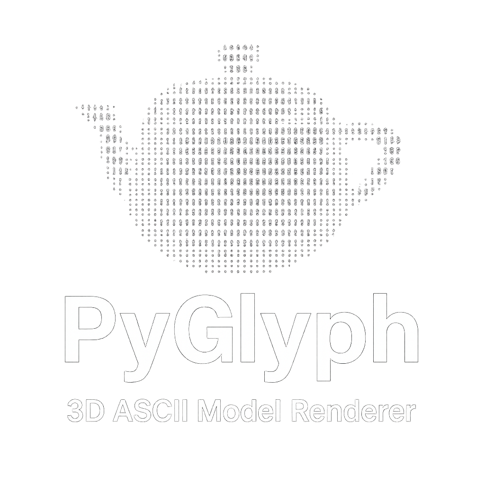

# PyGlyph: 3D ASCII Model Renderer

<p align="center">
  
</p>

PyGlyph is a Python-based 3D ASCII renderer capable of visualizing `.obj` models using ASCII art. Built using Pygame, Numpy, and Numba, PyGlyph offers smooth rendering and shading of complex 3D models.


## Features :rocket:

- **OBJ File Loading**: Supports standard `.obj` file formats.
- **ASCII Rendering**: Visualizes models using customizable ASCII character sets.
- **Smooth Shading**: Calculates vertex normals for realistic lighting.
- **Real-Time Rotation**: Supports continuous rotation along X and Y axes.
- **Ambient Lighting**: Adds subtle ambient lighting for depth perception.
- **Parallel Processing**: Uses Numba for optimized rendering performance.

## Requirements :construction:

- `pygame`
- `numpy`
- `numba`

Install dependencies using:

```bash
pip install pygame numpy numba
```

## Usage :gear:

```bash
python pyglyph.py
```

:warning: Place `model.obj` file in the same folder. If you need to convert your model from `.stl` you can use this website: 
<a href="https://convert3d.org/stl-to-obj" title="Convert 3D - Click to open" target="_blank" style="vertical-align: middle;">
    
</a> - *(Ctrl-click to open in a new tab)*

## Acknowledgments :sparkles:

This project was inspired by **AIKON's 3D donut ASCII renderer** written in C.  
You can check out AIKON's original work [here](https://www.a1k0n.net/2011/07/20/donut-math.html).
